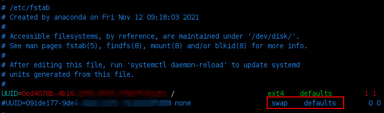

# How to Install k8s 

## Prerequisites
1. Two or more VM (note : i use three CentOS 8)
2. Install docker & cri-dockerd
3. root accses to every server, and  complete network conectivity among all VMs, edit in ```/etc/hosts```
   ```bash
   172.29.4.238 k8s-worker2.hostname.com
   172.29.4.239 k8s-worker1.hostname.com
   172.29.4.237 k8s-master.hostname.com
   ```
   
4. Permanent SWAP Disable


### 1. SWAP Disable
Why disable swap on kubernetes? 

[The idea of kubernetes is to tightly pack instances to as close to 100% utilized as possible. All deployments should be pinned with CPU/memory limits. So if the scheduler sends a pod to a machine it should never use swap at all. You don't want to swap since it'll slow things down. Its mainly for performance.][why_disable_swap]

Before actually disabling swap space, first you need to visualize your memory load degree and then identify the partition that holds the swap area, by issuing the below commands.
```bash
$ free -h 
```

In order to permanently disable swap space in Linux, open ```/etc/fstab``` file, search for the swap line and comment the entire line by adding a ```# (hashtag)``` sign in front of the line, as shown in the below screenshot.




### 2. Before you begin

 For information on how to create a cluster with kubeadm once you have performed this installation process, see the Creating a cluster with kubeadm page.[full docs][docs-kubeadm]

- Check required ports (Control plane) 

    | Protocol | Direction | Port Range | Purpose                 | Used By              |
    |----------|-----------|------------|-------------------------|----------------------|
    | TCP      | Inbound   | 6443       | Kubernetes API server   | All                  |
    | TCP      | Inbound   | 2379-2380  | etcd server client API  | kube-apiserver, etcd |
    | TCP      | Inbound   | 10250      | etcd server client API  | Self, Control plane  |
    | TCP      | Inbound   | 10259      | kube-scheduler          | Self                 |
    | TCP      | Inbound   | 10257      | kube-controller-manager | Self                 |

-  Check required ports (Worker node(s)) 
    | Protocol | Direction | Port Range   | Purpose                | Used By              |
    |----------|-----------|--------------|------------------------|----------------------|
    | TCP      | Inbound   | 10250        | Kubelet API            | Self, Control plane  |
    | TCP      | Inbound   | 30000-32767  | NodePort Services      | All                  |

### 3. Choses a container runtime
By default, Kubernetes uses the Container Runtime Interface (CRI) to interface with our chosen container runtime.
The tables below include the known endpoints for supported operating systems:

| Runtime       | Path to Unix domain socket                   |
|---------------|----------------------------------------------|
| containerd    | unix:///var/run/containerd/containerd.sock   |
| CRI-O         | unix:///var/run/crio/crio.sock               |
| Docker Engine | unix:///var/run/cri-dockerd.sock             |

because here we will use the docker-engine container runtime, so we have to install [cri-dockerd][cri-dcoker] first

### 4. Build and install Docker Engine (cri-dockerd)

install in every node[full documentattion][cri-dcoker]
```bash
git clone https://github.com/Mirantis/cri-dockerd.git

# Run these commands as root
###Install GO###
wget https://storage.googleapis.com/golang/getgo/installer_linux
chmod +x ./installer_linux
./installer_linux
source ~/.bash_profile ##if Using bash

cd cri-dockerd
mkdir bin
go build -o bin/cri-dockerd
mkdir -p /usr/local/bin
install -o root -g root -m 0755 bin/cri-dockerd /usr/local/bin/cri-dockerd
cp -a packaging/systemd/* /etc/systemd/system
sed -i -e 's,/usr/bin/cri-dockerd,/usr/local/bin/cri-dockerd,' /etc/systemd/system/cri-docker.service
systemctl daemon-reload
systemctl enable cri-docker.service
systemctl enable --now cri-docker.socket
```

### 5. Installing kubeadm, kubelet and kubectl 

We will install these packages on all of your machines:

- __kubeadm:__ the command to bootstrap the cluster.

- __kubelet:__ the component that runs on all of the machines in your cluster and does things like starting pods and containers.

- __kubectl:__ the command line util to talk to your cluster.

- Red Hat-based distributions :
  ```bash
    cat <<EOF | sudo tee /etc/yum.repos.d/kubernetes.repo
    [kubernetes]
    name=Kubernetes
    baseurl=https://packages.cloud.google.com/yum/repos/kubernetes-el7-\$basearch
    enabled=1
    gpgcheck=1
    gpgkey=https://packages.cloud.google.com/yum/doc/rpm-package-key.gpg
    exclude=kubelet kubeadm kubectl
    EOF

    # Set SELinux in permissive mode (effectively disabling it)
    sudo setenforce 0
    sudo sed -i 's/^SELINUX=enforcing$/SELINUX=permissive/' /etc/selinux/config

    sudo yum install -y kubelet kubeadm kubectl --disableexcludes=kubernetes

    sudo systemctl enable --now kubelet
  ```

### 6. Initializing your control-plane node 

The control-plane node is the machine where the control plane components run, including etcd (the cluster database) and the API Server (which the kubectl command line tool communicates with).

```bash
kubeadm init --cri-socket unix:///var/run/cri-dockerd.sock --pod-network-cidr=10.244.0.0/16
```
[```issue : NetworkPlugin cni failed```][issue_calico1]

[kubeadm init][kubeadm_init] then downloads and installs the cluster control plane components. This may take several minutes. After it finishes you should see:

```bash
Your Kubernetes control-plane has initialized successfully!

To start using your cluster, you need to run the following as a regular user:

  mkdir -p $HOME/.kube
  sudo cp -i /etc/kubernetes/admin.conf $HOME/.kube/config
  sudo chown $(id -u):$(id -g) $HOME/.kube/config

You should now deploy a Pod network to the cluster.
Run "kubectl apply -f [podnetwork].yaml" with one of the options listed at:
  /docs/concepts/cluster-administration/addons/

You can now join any number of machines by running the following on each node
as root:

  kubeadm join <control-plane-host>:<control-plane-port> --token <token> --discovery-token-ca-cert-hash sha256:<hash>

```

run the following command if non-root user,  Alternatively, if using root user, can run:
```bash
export KUBECONFIG=/etc/kubernetes/admin.conf
source .zshrc # or source .bashrc
```


[docs-kubeadm]: https://kubernetes.io/docs/setup/production-environment/tools/kubeadm/install-kubeadm/
[why_disable_swap]: https://serverfault.com/questions/881517/why-disable-swap-on-kubernetes
[cri-dcoker]: https://github.com/Mirantis/cri-dockerd
[kubeadm_init]: https://kubernetes.io/docs/setup/production-environment/tools/kubeadm/create-cluster-kubeadm/
[issue_calico1]: https://github.com/projectcalico/calico/issues/2418
